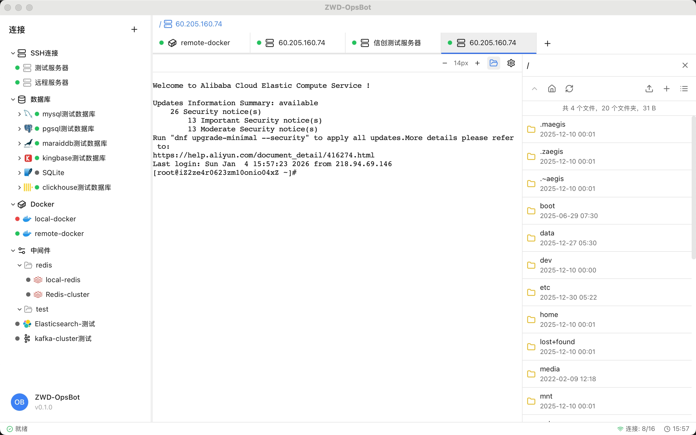
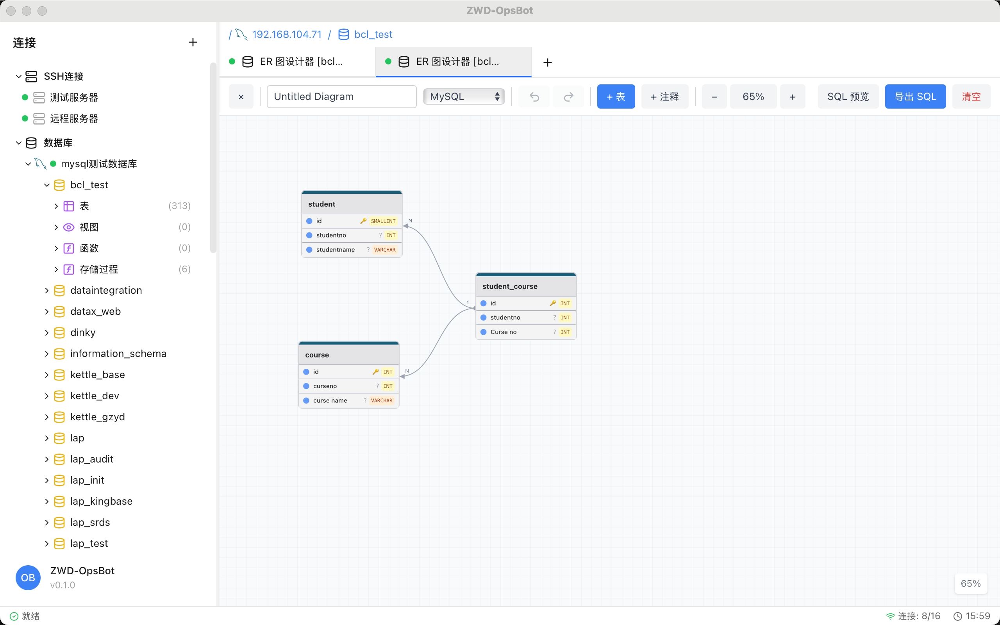
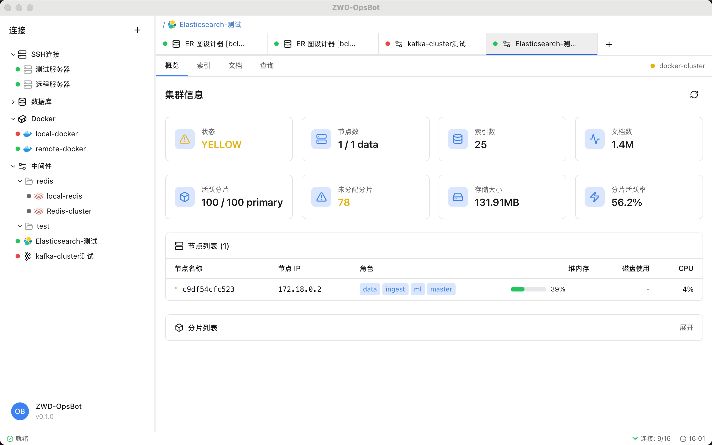
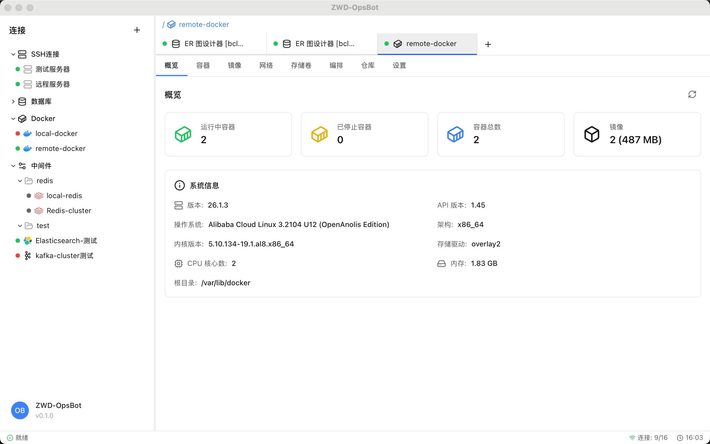

# ZWD-OpsBot

<div align="center">


一个功能强大的跨平台运维终端工具，整合了 SSH 终端、数据库客户端、中间件管理和 Docker 管理等功能。

[功能特性](#功能特性) • [技术栈](#技术栈) • [快速开始](#快速开始) • [开发指南](#开发指南)

</div>

## 📸 产品截图

<div align="center">

### SSH 终端界面


*支持多会话管理、快捷键操作、终端日志记录等功能*

---

### 数据库管理界面


*可视化表结构设计、SQL 编辑器、查询结果展示*

---

### 中间件管理界面


*Redis、Kafka、Elasticsearch、ClickHouse 统一管理*

---

### Docker 管理界面


*容器监控、日志查看、交互式终端、镜像管理*

---

### SFTP 文件管理界面


*文件浏览、拖拽上传下载、目录操作*

</div>

---

## 📋 目录

- [功能特性](#功能特性)
- [技术栈](#技术栈)
- [快速开始](#快速开始)
- [开发指南](#开发指南)
- [项目结构](#项目结构)
- [配置说明](#配置说明)
- [贡献指南](#贡献指南)
- [许可证](#许可证)

## ✨ 功能特性

### 🖥️ SSH 终端
- ✅ 支持密码和密钥认证
- ✅ 跳板机支持
- ✅ 多会话管理
- ✅ 终端日志记录
- ✅ 快捷键支持 (Ctrl+C 复制, Ctrl+V 粘贴)
- ✅ 右键菜单快捷操作
- ✅ 自定义字体大小
- ✅ 主题切换 (亮色/暗色)

### 📊 数据库管理
支持多种数据库：
- MySQL / MariaDB
- PostgreSQL
- SQLite
- SQL Server
- ClickHouse
- KingBase (人大金仓)

功能包括：
- 可视化表结构设计器
- SQL 编辑器（语法高亮）
- 查询结果展示与导出
- 表数据的增删改查

### 📦 中间件管理
- **Redis**: 键值管理、命令执行、集群支持
- **Kafka**: 主题管理、消息生产/消费
- **Elasticsearch**: 索引管理、文档查询
- **ClickHouse**: 数据库和表管理

### 🐳 Docker 管理
- 容器列表与状态监控
- 容器日志查看
- 交互式终端 (exec)
- Docker Compose 支持
- 镜像管理

### 📁 SFTP 文件管理
- 文件浏览与传输
- 拖拽上传/下载
- 文件重命名、删除
- 目录操作

## 🛠️ 技术栈

### 前端
- **框架**: React 18 + TypeScript
- **桌面端**: Tauri v2
- **UI 组件**: Radix UI
- **样式**: Tailwind CSS
- **状态管理**: Zustand
- **终端**: xterm.js
- **国际化**: i18next

### 后端
- **语言**: Rust
- **SSH**: russh
- **数据库驱动**: sqlx, tokio-postgres, mysql_async, clickhouse-rs
- **异步运行时**: tokio
- **序列化**: serde

## 🚀 快速开始

### 环境要求

- Node.js >= 18
- Rust >= 1.70
- pnpm (推荐) 或 npm

### 安装依赖

```bash
# 安装前端依赖
pnpm install

# 后端依赖会在编译时自动安装
```

### 开发模式

```bash
# 启动开发服务器 (前端 + 后端)
pnpm tauri dev
```

### 构建发布版本

```bash
# 构建生产版本
pnpm tauri build
```

构建产物位于 `backend/target/release/bundle/`

## 📖 开发指南

### 代码规范

- 每个函数不超过 80 行
- 单个代码文件不超过 800 行，超过需拆分
- 使用策略模式解耦多数据库实现
- 遵循 TypeScript/Rust 最佳实践

### 项目结构

```
ZWD-OpsBot/
├── front/                 # 前端代码
│   ├── components/        # React 组件
│   ├── stores/           # Zustand 状态管理
│   ├── services/         # API 服务层
│   ├── i18n/             # 国际化翻译
│   └── styles/           # 样式文件
├── backend/              # 后端代码 (Rust)
│   ├── src/
│   │   ├── commands/     # Tauri 命令
│   │   ├── services/     # 业务逻辑
│   │   └── models/       # 数据模型
│   ├── tauri.conf.json   # Tauri 配置
│   └── Cargo.toml        # Rust 依赖
├── spec/                 # 设计文档
└── CLAUDE.md             # AI 辅助开发指南
```

### 调试说明

本项目是 Tauri 桌面应用，调试时：
- 运行 `pnpm tauri dev` 启动开发服务器
- 查看后端日志输出定位问题
- 前端可使用浏览器开发者工具

### 添加新功能

1. 在 `spec/` 目录查看或创建功能设计文档
2. 实现功能代码
3. 添加国际化翻译（4 种语言）
4. 完成后更新 spec 文档的验收标准

### 国际化

翻译文件位于 `front/i18n/locales/`，支持：
- 简体中文 (`zh-CN.json`)
- 繁体中文 (`zh-TW.json`)
- 英文 (`en-US.json`)
- 日文 (`ja-JP.json`)

## 🎨 配置说明

### Tauri 配置

主要配置位于 `backend/tauri.conf.json`：
- 窗口大小和行为
- 应用权限
- 构建选项
- 图标资源

### 数据库连接

应用使用本地 SQLite 存储连接配置（敏感信息已加密）

## 🤝 贡献指南

欢迎贡献代码！请遵循以下步骤：

1. Fork 本仓库
2. 创建功能分支 (`git checkout -b feature/AmazingFeature`)
3. 提交更改 (`git commit -m 'Add some AmazingFeature'`)
4. 推送到分支 (`git push origin feature/AmazingFeature`)
5. 提交 Pull Request

## 📝 许可证

本项目采用 MIT 许可证 - 查看 [LICENSE](LICENSE) 文件了解详情

## 🙏 致谢

- [Tauri](https://tauri.app/) - 跨平台桌面应用框架
- [xterm.js](https://xtermjs.org/) - 终端模拟器
- [Radix UI](https://www.radix-ui.com/) - UI 组件库
- [russh](https://github.com/warp-tech/russh) - Rust SSH 库

---

<div align="center">

Made with ❤️ by ZWD Team

</div>
